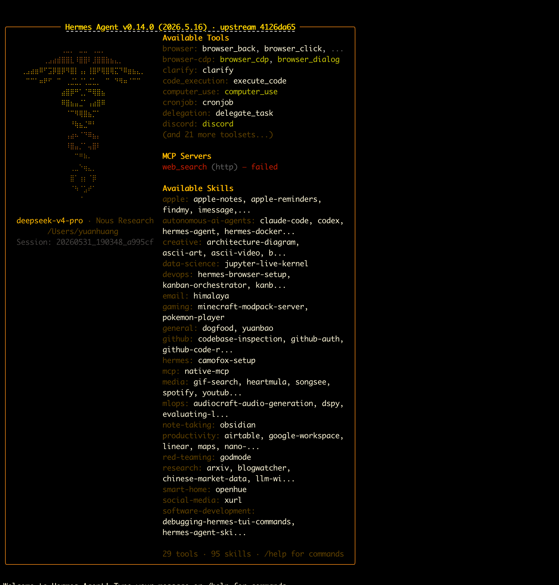
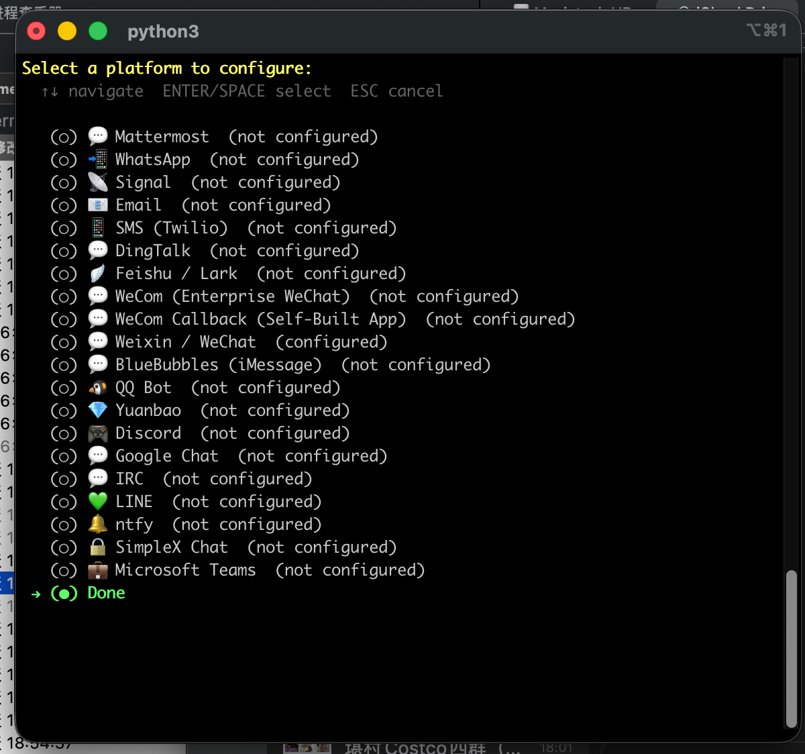
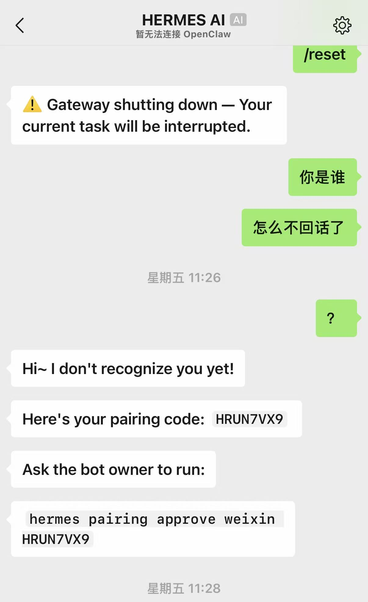
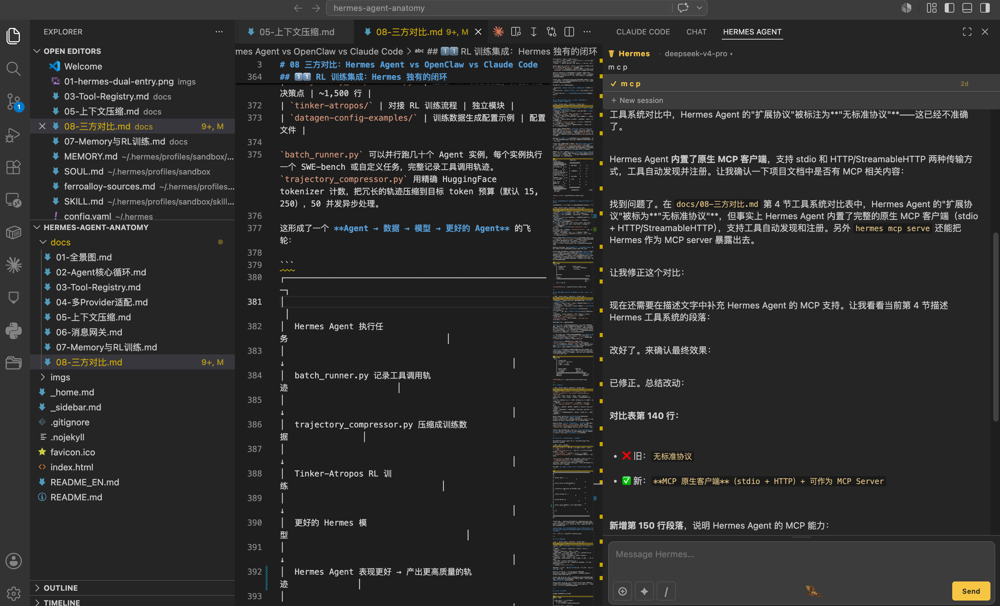

# 10 Hermes Agent 安装与使用教程

> 基于 Hermes Agent 官方文档（v0.8.0）撰写的安装与使用指南。官网：https://hermes-agent.nousresearch.com/docs/zh-Hans

---

## 一、安装

### 1.1 环境要求

| 依赖 | 最低版本 |
|------|---------|
| Python | 3.11+ |
| Node.js | 22+（部分功能需要）|
| Git | 任意（安装器可自动处理可移植版）|
| 操作系统 | Linux / macOS / WSL2 / Windows / Android (Termux) |

### 1.2 安装方式

#### Linux / macOS / WSL2 / Termux（推荐 —— 跟踪 main 分支）

```bash
curl -fsSL https://raw.githubusercontent.com/NousResearch/hermes-agent/main/scripts/install.sh | bash
```

安装完成后运行：

```bash
source ~/.bashrc
```

#### Windows（PowerShell，早期 Beta）

```powershell
iex (irm https://raw.githubusercontent.com/NousResearch/hermes-agent/main/scripts/install.ps1)
```

安装程序自动处理：`uv`、Python 3.11、Node.js 22、ripgrep、ffmpeg 以及可移植 Git。仓库克隆到 `%LOCALAPPDATA%\hermes\hermes-agent`，创建虚拟环境，将 `hermes` 添加到用户 PATH。

> **注意：** Windows 原生支持除浏览器仪表板聊天面板外的所有功能（仪表板仅限 WSL2，因使用 POSIX PTY）。

#### pip 安装（跟踪带标签的发布版本）

```bash
pip install hermes-agent
hermes postinstall
```

#### Docker 安装

Hermes 提供官方 Docker 镜像 `nousresearch/hermes-agent`。镜像本身无状态，所有用户数据存储在宿主机挂载的 `/opt/data` 目录中。拉取新版本即可升级，不会丢失任何配置。

**镜像基于 debian:13.4**，内置 Python 3 + 全部依赖、Node.js + npm、Playwright + Chromium、ripgrep、ffmpeg、git、docker-cli、openssh-client、WhatsApp 桥接，以 s6-overlay v3 作为 PID 1 进程监管器。

> **注意：** Docker 与 Hermes 有两种交集方式：
> 1. **在 Docker 中运行 Hermes**（本节的內容）— Agent 本身在容器内运行
> 2. **Docker 作为终端后端** — Agent 在宿主机运行，命令在持久化 Docker 沙箱容器中执行（参见配置参考中的 `terminal.backend: docker`）

**快速开始 —— 首次配置：**

```bash
# 创建数据目录
mkdir -p ~/.hermes

# 交互式运行设置向导（只需执行一次）
docker run -it --rm \
  -v ~/.hermes:/opt/data \
  nousresearch/hermes-agent setup
```

向导会提示输入 API 密钥并写入 `~/.hermes/.env`。

**以 Gateway 模式运行：**

```bash
docker run -d \
  --name hermes \
  --restart unless-stopped \
  -v ~/.hermes:/opt/data \
  -p 8642:8642 \
  nousresearch/hermes-agent gateway run
```

端口 8642 暴露 Gateway 的 OpenAI 兼容 API 和健康检查端点。仅使用聊天平台（Telegram、Discord 等）时端口可选。

**启用 API Server：**

```bash
docker run -d \
  --name hermes \
  --restart unless-stopped \
  -v ~/.hermes:/opt/data \
  -p 8642:8642 \
  -e API_SERVER_ENABLED=true \
  -e API_SERVER_HOST=0.0.0.0 \
  -e API_SERVER_KEY="$(openssl rand -hex 32)" \
  -e API_SERVER_CORS_ORIGINS='*' \
  nousresearch/hermes-agent gateway run
```

> **安全警告：** 在面向互联网的机器上开放端口存在安全风险，请确保了解相关风险。

**运行 Dashboard：**

```bash
docker run -d \
  --name hermes \
  --restart unless-stopped \
  -v ~/.hermes:/opt/data \
  -p 8642:8642 \
  -e HERMES_DASHBOARD=1 \
  nousresearch/hermes-agent gateway run
```

Dashboard 环境变量：

| 环境变量 | 描述 | 默认值 |
|---------|------|--------|
| `HERMES_DASHBOARD` | 设为 `1` 以启动 dashboard | 未设置 |
| `HERMES_DASHBOARD_HOST` | Dashboard HTTP 绑定地址 | `127.0.0.1` |
| `HERMES_DASHBOARD_PORT` | Dashboard HTTP 端口 | `9119` |
| `HERMES_DASHBOARD_TUI` | 设为 `1` 启用浏览器内 Chat 标签页（PTY/WebSocket） | 未设置 |
| `HERMES_DASHBOARD_INSECURE` | 设为 `1` 禁用 OAuth 鉴权门控 | 未设置 |

Dashboard 默认绑定回环地址。发布到网络时设置 `HERMES_DASHBOARD_HOST=0.0.0.0`。绑定非回环地址 + 注册了 `DashboardAuthProvider` 时，OAuth 鉴权自动启用。未注册 provider 且绑定非回环地址时，dashboard 启动失败关闭并给出具体错误。

> **备注：** Dashboard 在容器内作为受监管的 s6 服务运行。崩溃后 s6-overlay 自动重启，无需重启容器。不支持将 dashboard 作为独立容器运行——其 gateway 存活检测需要与 gateway 共享 PID 命名空间。

**交互式运行（CLI 聊天）：**

```bash
# 对已有数据目录打开交互式聊天
docker run -it --rm \
  -v ~/.hermes:/opt/data \
  nousresearch/hermes-agent

# 或在已运行容器内直接执行
docker exec -it hermes /opt/hermes/.venv/bin/hermes
```

**持久化卷 —— `/opt/data`：**

| 路径 | 内容 |
|------|------|
| `.env` | API 密钥和机密 |
| `config.yaml` | 所有 Hermes 配置 |
| `SOUL.md` | Agent 个性/身份 |
| `sessions/` | 对话历史 |
| `memories/` | 持久化记忆存储 |
| `skills/` | 已安装的技能 |
| `cron/` | 定时任务定义 |
| `hooks/` | 事件 hook |
| `logs/` | 运行时日志 |
| `skins/` | 自定义 CLI 皮肤 |

> **注意：** 切勿同时对同一数据目录运行两个 Hermes gateway 容器——会话文件和记忆存储不支持并发写入。

**多 Profile 支持：**

在 Docker 下推荐每个 profile 一个容器，各自绑定挂载独立目录：

```bash
# 工作 profile
docker run -d \
  --name hermes-work \
  --restart unless-stopped \
  -v ~/.hermes-work:/opt/data \
  -p 8642:8642 \
  nousresearch/hermes-agent gateway run

# 个人 profile
docker run -d \
  --name hermes-personal \
  --restart unless-stopped \
  -v ~/.hermes-personal:/opt/data \
  -p 8643:8642 \
  nousresearch/hermes-agent gateway run
```

独立容器的优势：隔离性强（崩溃不影响其他 profile）、独立生命周期（可分别升级/重启）、清晰的端口和网络隔离、避免并发写入风险。

**Docker Compose 示例：**

```yaml
services:
  hermes:
    image: nousresearch/hermes-agent:latest
    container_name: hermes
    restart: unless-stopped
    command: gateway run
    ports:
      - "8642:8642"   # gateway API
      - "9119:9119"   # dashboard（仅 HERMES_DASHBOARD=1 时生效）
    volumes:
      - ~/.hermes:/opt/data
    environment:
      - HERMES_DASHBOARD=1
      # 取消注释以直接转发环境变量而非使用 .env 文件：
      # - ANTHROPIC_API_KEY=${ANTHROPIC_API_KEY}
      # - OPENAI_API_KEY=${OPENAI_API_KEY}
      # - TELEGRAM_BOT_TOKEN=${TELEGRAM_BOT_TOKEN}
    deploy:
      resources:
        limits:
          memory: 4G
          cpus: "2.0"
```

多 profile Docker Compose：

```yaml
services:
  hermes-work:
    image: nousresearch/hermes-agent:latest
    container_name: hermes-work
    restart: unless-stopped
    command: gateway run
    ports:
      - "8642:8642"
    volumes:
      - ~/.hermes-work:/opt/data

  hermes-personal:
    image: nousresearch/hermes-agent:latest
    container_name: hermes-personal
    restart: unless-stopped
    command: gateway run
    ports:
      - "8643:8642"
    volumes:
      - ~/.hermes-personal:/opt/data
```

启动：

```bash
docker compose up -d
docker compose logs -f
```

**环境变量转发：**

API 密钥从 `/opt/data/.env` 读取，也可直接传递（覆盖 .env 中的值）：

```bash
docker run -it --rm \
  -v ~/.hermes:/opt/data \
  -e ANTHROPIC_API_KEY="sk-ant-..." \
  -e OPENAI_API_KEY="sk-..." \
  nousresearch/hermes-agent
```

适用于不希望密钥写入磁盘的 CI/CD 或密钥管理器集成场景。

**资源限制：**

| 资源 | 最低 | 推荐 |
|------|------|------|
| 内存 | 1 GB | 2–4 GB |
| CPU | 1 核 | 2 核 |
| 磁盘（数据卷）| 500 MB | 2+ GB |

浏览器自动化（Playwright/Chromium）最耗内存。如不需要浏览器工具，1 GB 即可。

```bash
docker run -d \
  --name hermes \
  --restart unless-stopped \
  --memory=4g --cpus=2 \
  -v ~/.hermes:/opt/data \
  nousresearch/hermes-agent gateway run
```

**在容器中安装更多工具：**

| 方式 | 适用场景 |
|------|---------|
| `npx` / `uvx` | npm 或 PyPI 工具，按需获取，配置写入 `/opt/data` |
| `apt-get install` + 记住命令 | 其他工具，安装后在容器生命周期内可用，重启后重新安装 |
| 构建派生镜像 | 每次启动必须立即可用的工具，写入 Dockerfile 层 |
| Sidecar 容器 | 自带服务的复杂工具（数据库、队列等），独立容器通过共享网络访问 |
| 提交 issue/PR | 对大多数用户有用的工具，贡献到上游 |

**连接本地推理服务器（vLLM、Ollama 等）：**

Docker Compose（推荐，最可靠）：

```yaml
services:
  vllm:
    image: vllm/vllm-openai:latest
    container_name: vllm
    command: >
      --model Qwen/Qwen2.5-7B-Instruct
      --served-model-name my-model
      --host 0.0.0.0 --port 8000
    ports:
      - "8000:8000"
    networks:
      - hermes-net
    deploy:
      resources:
        reservations:
          devices:
            - capabilities: [gpu]

  hermes:
    image: nousresearch/hermes-agent:latest
    container_name: hermes
    restart: unless-stopped
    command: gateway run
    ports:
      - "8642:8642"
    volumes:
      - ~/.hermes:/opt/data
    networks:
      - hermes-net

networks:
  hermes-net:
    driver: bridge
```

然后在 `config.yaml` 中使用容器名称作为主机名：

```yaml
model:
  provider: custom
  model: my-model
  base_url: http://vllm:8000/v1
  api_key: "none"
```

**关键点：** 使用容器名称（如 `vllm`）作为主机名——而非 `localhost` 或 `127.0.0.1`，它们指向 Hermes 容器自身。`model` 值须与 `--served-model-name` 一致。`base_url` 末尾不加斜杠。

宿主机推理服务器（非 Docker）：

```bash
# macOS / Windows — 使用 host.docker.internal
docker run -d --name hermes -v ~/.hermes:/opt/data -p 8642:8642 \
  nousresearch/hermes-agent gateway run

# config.yaml → base_url: http://host.docker.internal:8000/v1

# Linux — 使用 --network host
docker run -d --name hermes --network host -v ~/.hermes:/opt/data \
  nousresearch/hermes-agent gateway run

# config.yaml → base_url: http://127.0.0.1:8000/v1
```

Ollama 同理，使用 `host.docker.internal:11434`（macOS/Windows）或 `127.0.0.1:11434`（Linux `--network host`）。

验证连通性：

```bash
docker exec hermes curl -s http://vllm:8000/v1/models
```

**升级：**

```bash
# 纯 Docker
docker pull nousresearch/hermes-agent:latest
docker rm -f hermes
docker run -d --name hermes --restart unless-stopped \
  -v ~/.hermes:/opt/data \
  nousresearch/hermes-agent gateway run

# Docker Compose
docker compose pull
docker compose up -d
```

**故障排查：**

| 问题 | 解决 |
|------|------|
| 容器立即退出 | `docker logs hermes`，常见原因：`.env` 缺失或无效、端口冲突 |
| Permission denied | `chmod -R 755 ~/.hermes` 或设置 `HERMES_UID`/`HERMES_GID` 匹配宿主机用户 |
| 浏览器工具无法使用 | 添加 `--shm-size=1g`（Playwright 需要共享内存）|
| Gateway 无法重连 | `docker restart hermes`（`--restart unless-stopped` 处理大多数瞬时故障）|
| 检查健康状态 | `docker logs --tail 50 hermes`、`docker stats hermes` |

**权限模型：** s6-overlay 的 `/init` 以 root 运行，在首次启动时对卷执行 chown，然后通过 `s6-setuidgid` 将每个受监管服务及主程序降权至 `hermes` 用户。以 root 启动 `hermes gateway run` 默认被拒绝（可能在 `/opt/data` 中留下 root 所有的文件）。仅在有意接受该风险时设置 `HERMES_ALLOW_ROOT_GATEWAY=1`。

### 1.3 安装目录结构

| 安装方式 | 代码位置 | 二进制文件 | 数据目录 |
|----------|---------|-----------|---------|
| pip install | Python site-packages | `~/.local/bin/hermes` | `~/.hermes/` |
| 用户级 git | `~/.hermes/hermes-agent/` | `~/.local/bin/hermes`（符号链接）| `~/.hermes/` |
| 根模式 | `/usr/local/lib/hermes-agent/` | `/usr/local/bin/hermes` | `/root/.hermes/` 或 `$HERMES_HOME` |

### 1.4 验证安装

```bash
hermes --version
hermes doctor
```

`hermes doctor` 会检查所有依赖、配置完整性，以及安全公告（如供应链扫描）。

---

## 二、快速开始

### 2.1 配置 LLM Provider

安装完成后首次运行 `hermes` 会进入交互式配置向导。你也可以直接编辑配置文件：

```yaml
# ~/.hermes/config.yaml
api:
  provider: openrouter       # 或 anthropic / openai / nous
  model: anthropic/claude-sonnet-4-6
  base_url: https://openrouter.ai/api/v1
  api_key: ${OPENROUTER_API_KEY}   # 支持环境变量引用
```

支持 15+ Provider 的开箱即用配置，包括 OpenAI、Anthropic、OpenRouter、Nous Portal、DeepSeek、Qwen 等。

### 2.2 开始对话

```bash
# 经典 CLI（基于 prompt_toolkit，多行编辑、斜杠命令补全）
hermes

# 现代 TUI（模态覆盖层、鼠标选择）
hermes --tui

# 单次查询（非交互模式）
hermes chat -q "解释这段代码：cat main.py"

# 恢复最近的会话
hermes --continue
# 或
hermes -c
```



---

---

## 三、CLI 使用详解

### 3.1 状态栏

输入区上方实时显示：

- **模型名称**（当前使用的 LLM）
- **令牌计数**（已用 / 最大）
- **上下文进度条**：绿色 <50%，黄色 50-80%，橙色 80-95%，红色 ≥95%
- **估计成本**（美元）
- **压缩次数** `[N]`（当前会话中自动压缩次数）
- **后台任务数**
- **会话时长**
- **YOLO 模式警告**

### 3.2 键盘快捷键

| 快捷键 | 功能 |
|--------|------|
| `Enter` | 发送消息 |
| `Alt+Enter` / `Ctrl+J` / `Shift+Enter` | 换行 |
| `Ctrl+B` | 切换语音录制 |
| `Ctrl+G` | 在 `$EDITOR` 中打开输入缓冲区 |
| `Ctrl+C` | 中断 Agent（2 秒内双击强制退出）|
| `Ctrl+D` | 退出 |
| `Ctrl+Z` | 将 Hermes 置于后台（Unix）|

### 3.3 核心斜杠命令

| 命令 | 功能 |
|------|------|
| `/help` | 显示帮助 |
| `/model` | 切换当前模型 |
| `/tools` | 查看可用工具 |
| `/skills browse` | 浏览已安装技能 |
| `/background <prompt>` | 在后台运行独立 Agent 任务 |
| `/skin` | 更换主题 |
| `/voice on` | 开启语音输入 |
| `/voice off` | 关闭语音输入 |
| `/reasoning high` | 开启高推理模式 |
| `/reasoning off` | 关闭推理模式 |
| `/title <名称>` | 为当前会话命名 |
| `/compress` | 手动触发上下文压缩 |
| `/yolo` | 切换 YOLO 模式（跳过命令审批）|
| `/busy` | 设置忙时输入模式 |

### 3.4 忙时输入模式

通过 `/busy` 或配置 `display.busy_input_mode` 设置：

| 模式 | 行为 |
|------|------|
| `interrupt`（默认）| 立即中断正在进行的操作 |
| `queue` | 静默排队，待 Agent 完成后发送 |
| `steer` | 通过 `/steer` 注入到当前运行中（不中断）|

### 3.5 后台会话

在独立守护线程中运行 Agent 任务，完全非阻塞：

```bash
# 启动后台任务
/background 帮我研究一下这个项目里所有的 API 端点

# 启动时预加载技能
hermes -s skill1,skill2
```

支持多个并发后台任务，每个有独立 ID。

### 3.6 隔离 Worktree 模式

在隔离的 git worktree 中运行 Agent：

```bash
hermes -w
```

---

## 四、高级功能

### 4.1 内存系统

**自动记忆：** Agent 在对话中自动通过 `memory` 工具管理 MEMORY.md 和 USER.md。

**手动管理：**

```bash
# 查看当前记忆
cat ~/.hermes/memories/MEMORY.md
cat ~/.hermes/memories/USER.md

# 对话中操作记忆
# Agent 会自行调用 memory 工具，也可以直接要求：
"把"这个项目用的是 Go 1.22 和 PostgreSQL"记到记忆里"
```

**配置外部 Memory Provider：**

```bash
# 列出可用的记忆后端
hermes memory list

# 配置 Honcho 作为外部后端
hermes memory setup honcho
```

### 4.2 技能系统 (Skills)

Agent 可以在复杂任务成功后**自动创建技能**，把方法论固化下来。

技能目录结构：

```
~/.hermes/skills/
├── my-skill/
│   ├── SKILL.md           # YAML frontmatter + Markdown 正文
│   ├── references/        # 参考资料
│   ├── templates/         # 模板文件
│   ├── scripts/           # 脚本
│   └── assets/            # 其他资源
```

### 4.3 会话管理

```bash
# 查看会话列表
hermes sessions list

# 恢复指定会话
hermes sessions resume <session_id>

# 搜索历史对话
# 在对话中使用 session_search 工具
```

所有会话存储在 SQLite `~/.hermes/state.db` 中，带 FTS5 全文搜索。

### 4.4 Gateway 模式（多平台消息网关）

Hermes 可以作为消息网关运行，同时服务 11 个平台：

```bash
hermes gateway
```

支持平台：Telegram、Discord、Slack、WhatsApp、Signal、Matrix、Email、HomeAssistant、Mattermost、DingTalk（钉钉）、Feishu（飞书）。

Gateway 配置见 `~/.hermes/config.yaml` 的 `gateway` 部分。


#### 微信（WeChat / Weixin）对接详解

Hermes 通过腾讯 iLink Bot API 对接**个人微信账号**（非企业微信）。消息通过 HTTP 长轮询传递，无需公网端点。

**前置条件：**

```bash
pip install aiohttp cryptography
# 或使用 messaging 扩展
pip install hermes-agent[messaging]
```

**配置步骤：**

**第一步 —— 运行交互式配置向导：**

```bash
hermes gateway setup
```

选择 Weixin，向导自动：向 iLink Bot API 请求二维码 → 终端显示二维码 → 用微信扫描 → 手机端确认登录 → 凭据保存至 `~/.hermes/weixin/accounts/`。成功后显示：`微信连接成功，account_id=your-account-id`。





使用微信与 Hermes 交互——用户通过微信扫码配对后，Gateway 生成 8 位配对码完成 DM 授权认证，并在后端输入配对码完成绑定。成功后用户可以直接向 Hermes 发送私信。


**第二步 —— 配置环境变量（`~/.hermes/.env`）：**

```bash
WEIXIN_ACCOUNT_ID=your-account-id

# 可选：私信访问策略
WEIXIN_DM_POLICY=open

# 可选：白名单用户（dm_policy=allowlist 时生效）
WEIXIN_ALLOWED_USERS=user_id_1,user_id_2

# 可选：群组策略（默认 disabled，见下方注意事项）
WEIXIN_GROUP_POLICY=disabled
```

**第三步 —— 启动网关：**

```bash
hermes gateway
```

适配器自动恢复凭据、连接 iLink API、开始长轮询消息。

**访问策略：**

| 策略 | 值 | 行为 |
|------|-----|------|
| **私信 (DM)** | `open`（默认） | 任何人都可发私信 |
| | `allowlist` | 仅 `WEIXIN_ALLOWED_USERS` 中的用户 |
| | `disabled` | 忽略所有私信 |
| | `pairing` | 配对模式（首次设置用） |
| **群组 (Group)** | `disabled`（默认） | 忽略所有群消息 |
| | `open` | 所有群响应（需 iLink 推送群事件） |
| | `allowlist` | 仅白名单群组 |

**iLink Bot 限制：** 扫码登录后连接的是 iLink bot 身份（如 `a5ace6fd482e@im.bot`），非普通个人微信账号。群事件通常不会被 iLink 推送到网关。大多数情况下只有私信能可靠工作。若配置群组策略后仍收不到群消息，限制来自 iLink 侧。

**功能特性：**

| 特性 | 说明 |
|------|------|
| 长轮询传输 | 无需公网端点或 webhook |
| 媒体支持 | 图片/视频/文件/语音，AES-128-ECB 自动加解密 |
| Markdown 渲染 | 保留标题、表格、代码块格式 |
| 智能分块 | 4000 字以内保持单条消息，超长在逻辑边界拆分 |
| 正在输入提示 | 处理消息时显示"正在输入…"状态 |
| 消息去重 | 5 分钟滑动窗口 |
| 上下文 Token 持久化 | 基于磁盘，重启后回复连续性不中断 |
| 自动重试 | 瞬时错误 2s 后重试，持续错误退避 30s |
| SSRF 防护 | 出站媒体 URL 验证 |

**完整环境变量：**

| 变量 | 必填 | 默认值 | 说明 |
|------|------|--------|------|
| `WEIXIN_ACCOUNT_ID` | ✅ | — | iLink Bot 账号 ID |
| `WEIXIN_TOKEN` | ✅ | — | iLink Bot token（扫码自动保存） |
| `WEIXIN_BASE_URL` | — | `https://ilinkai.weixin.qq.com` | iLink API 基础 URL |
| `WEIXIN_CDN_BASE_URL` | — | `https://novac2c.cdn.weixin.qq.com/c2c` | CDN 基础 URL |
| `WEIXIN_DM_POLICY` | — | `open` | 私信策略 |
| `WEIXIN_GROUP_POLICY` | — | `disabled` | 群组策略 |
| `WEIXIN_ALLOWED_USERS` | — | 空 | 私信白名单（逗号分隔） |
| `WEIXIN_GROUP_ALLOWED_USERS` | — | 空 | 群组白名单（逗号分隔群 ID） |

**故障排查：**

| 问题 | 解决 |
|------|------|
| `aiohttp and cryptography are required` | `pip install aiohttp cryptography` |
| `WEIXIN_TOKEN is required` | 运行 `hermes gateway setup` 完成扫码 |
| 会话过期（errcode=-14） | 重新运行 `hermes gateway setup` 扫码 |
| Bot 不响应私信 | 检查 `WEIXIN_DM_POLICY`，若为 `allowlist` 确认发送方在白名单中 |
| Bot 忽略群消息 | 默认 `disabled`，设为 `open`/`allowlist`。如仍无效，限制来自 iLink |
| 消息重复 | 检查是否有多个网关实例在运行 |
| 二维码无法渲染 | `pip install hermes-agent[messaging]` |

### 4.5 VS Code 集成

Hermes 可以集成到 VS Code 中作为 AI 编程助手使用：



配置方式：
1. 在 VS Code 扩展市场搜索并安装 Hermes Agent 扩展
2. 扩展会自动检测 `~/.hermes/config.yaml` 中的配置
3. 通过侧边栏或命令面板（`Ctrl+Shift+P`）启动 Hermes 对话
4. 选中代码后可直接向 Hermes 提问或要求重构

### 4.6 Web Dashboard

Hermes 内置 Web 管理界面，启动 Gateway 后可通过浏览器访问：
使用指令 hermes dashboard
默认访问地址 127.0.0.1:9119，登录后可视化管理会话、配置平台、查看日志、切换模型、编辑记忆等。


Dashboard 提供：
- **会话管理**：浏览、搜索、恢复历史对话
- **平台配置**：可视化配置 Telegram/Discord/Slack 等消息平台
- **记忆编辑**：直接编辑 MEMORY.md 和 USER.md
- **日志查看**：实时查看 Gateway 日志和 Agent 运行状态
- **模型切换**：快速切换使用的 LLM 模型

### 4.7 安全模式
```bash
# YOLO 模式（跳过命令审批，有红色横幅警告）
hermes --yolo
# 或在对话中输入 /yolo

# 通过环境变量启用
HERMES_YOLO_MODE=1 hermes

# Docker 沙箱模式（推荐生产环境使用）
# 在 config.yaml 中设置:
# terminal:
#   backend: docker
```

---

## 五、配置参考

> 以下基于一份真实的 macOS 环境 `~/.hermes/config.yaml` 逐参数说明。配置文件版本 `_config_version: 24`。

### 5.0 全局模型配置

```yaml
model:
  default: deepseek-v4-pro          # 默认使用的模型名（对应 custom_providers 中定义的模型）
  provider: deekseekv4pro           # 默认 provider（对应 custom_providers 的 name）
  base_url: http://172.20.10.7:1235/v1  # API 端点（此处为本地 LM Studio，127.0.0.1 变体）
  api_key: sk-lm-FTEBQu1E:XXXXXXXXXXXXXX  # API 密钥
  api_mode: chat_completions        # API 模式：chat_completions | anthropic_messages | codex_responses
```

| 参数 | 说明 |
|------|------|
| `default` | 启动时使用的默认模型名，对应 `custom_providers[].models` 的 key |
| `provider` | 关联的 provider 名称，指向 `custom_providers` 中的某个条目 |
| `base_url` | API 端点地址，支持 OpenAI 兼容接口 |
| `api_key` | 对应 provider 的 API Key，也可用 `${ENV_VAR}` 引用环境变量 |
| `api_mode` | 强制指定 API 协议，留空则自动检测（根据 base_url/ provider 特征判断） |

### 5.1 自定义 Provider

```yaml
custom_providers:
- name: deekseekv4pro              # provider 标识名
  base_url: https://api.deepseek.com
  api_key: sk-XXXXXXXXXXXXXXXXXXXXXXXXXXX
  api_mode: chat_completions
  models:
    deepseek-v4-pro:               # 模型名（model.default 使用此 key）
      context_length: 1000000      # 上下文窗口长度
      name: DeepSeek V4 Pro        # 显示名称
    deepseek-v4-flash:
      context_length: 1000000
      name: DeepSeek V4 Flash
  model: deepseek-v4-pro           # 此 provider 的默认模型

- name: lmstudio                   # 本地推理服务器
  base_url: http://172.20.10.7:1235/v1
  api_key: sk-XXXXXXXXXXXXXXXXXXXXXXXXXXX
  models:
    google/gemma-4-e4b:
      context_length: 131072
      name: google/gemma-4-e4b
  api_mode: chat_completions
  model: google/gemma-4-e4b
```

| 参数 | 说明 |
|------|------|
| `name` | Provider 唯一标识，在其他配置项中引用 |
| `base_url` | API 端点 |
| `api_key` | 该 provider 的密钥 |
| `api_mode` | API 协议类型 |
| `models` | 此 provider 支持的模型列表，key 是模型 ID |
| `models.<id>.context_length` | 该模型的上下文窗口大小，用于压缩阈值计算 |
| `models.<id>.name` | 模型在 UI 中的显示名称 |
| `model` | 使用此 provider 时的默认模型 |

`providers: {}` 和 `fallback_providers: []` 留空时继承 `custom_providers` 的配置，`credential_pool_strategies: {}` 不启用多 key 调度。

### 5.2 Agent 核心参数

```yaml
agent:
  max_turns: 90                    # 单次对话最大迭代次数（工具调用轮数）
  gateway_timeout: 1800            # Gateway 模式下 agent 总超时（秒），30 分钟
  restart_drain_timeout: 180       # 重启前等待进行中请求完成的宽限期（秒）
  api_max_retries: 3               # API 调用失败最大重试次数
  service_tier: ''                 # 服务等级（auto/default/flex），仅 OpenAI 有效
  tool_use_enforcement: auto       # 工具使用策略（auto/none/required）
  gateway_timeout_warning: 900     # Gateway 超时前 15 分钟发警告提醒
  clarify_timeout: 600             # clarify 工具等待用户回复的超时（秒）
  gateway_notify_interval: 180     # Gateway 长任务中发送"还在工作"通知的间隔（秒）
  gateway_auto_continue_freshness: 3600  # 自动续接会话的有效期（秒），1 小时
  image_input_mode: auto           # 图片输入方式（auto/base64/url/none）
  disabled_toolsets: []            # 禁用的工具集列表
  verbose: false                   # 详细日志输出
  reasoning_effort: medium         # 推理强度（low/medium/high），影响 thinking token 量
```

| 参数 | 默认值 | 说明 |
|------|--------|------|
| `max_turns` | 90 | 每次对话中 Agent 最多调用多少次工具。防止死循环 |
| `gateway_timeout` | 1800 | Gateway 模式下单个请求的最大执行时间。超时后强制终止 |
| `restart_drain_timeout` | 180 | 收到 SIGTERM 后等待现有请求完成的时间 |
| `api_max_retries` | 3 | API 调用失败后的最大重试次数，与 jittered_backoff 配合 |
| `tool_use_enforcement` | auto | `auto`=模型自行决定是否用工具，`required`=强制使用工具，`none`=禁用工具 |
| `gateway_timeout_warning` | 900 | 剩余执行时间低于此值时给 Agent 注入时间压力提示 |
| `clarify_timeout` | 600 | 向用户提问后等待回复的超时，超时后继续执行 |
| `gateway_notify_interval` | 180 | 长时间无回复时，Gateway 主动通知用户"还在处理中"的间隔 |
| `gateway_auto_continue_freshness` | 3600 | 用户发送新消息时，若距上次会话结束在此时间内则自动续接 |

### 5.3 终端与沙箱配置

```yaml
terminal:
  backend: docker                   # 终端后端类型
  modal_mode: auto                  # Modal 沙箱模式
  cwd: .                            # Agent 工作目录（. = 启动时的当前目录）
  timeout: 180                      # 单次命令执行超时（秒）
  env_passthrough: []               # 从宿主机传递到沙箱的环境变量列表
  shell_init_files: []              # 沙箱中额外 source 的 shell 配置文件
  auto_source_bashrc: true          # 自动 source ~/.bashrc
  docker_image: hermes-agent-env:latest  # Docker 后端使用的镜像
  docker_forward_env: '["ANTHROPIC_API_KEY", "GH_TOKEN", "GITHUB_TOKEN", "HOME"]'
  docker_env: {}                    # 注入 Docker 容器的额外环境变量
  singularity_image: docker://nikolaik/python-nodejs:python3.11-nodejs20
  modal_image: nikolaik/python-nodejs:python3.11-nodejs20
  daytona_image: nikolaik/python-nodejs:python3.11-nodejs20
  vercel_runtime: node24
  container_cpu: 1                  # 容器 CPU 核数限制
  container_memory: 5120            # 容器内存限制（MB），= 5GB
  container_disk: 51200             # 容器磁盘限制（MB），= 50GB
  container_persistent: true        # 是否持久化容器（工具调用间保持存活）
  docker_volumes: '["/Users/yuanhuang/.claude:/root/.claude", "/Users/yuanhuang/.claude.json:/root/.claude.json", "/Users/yuanhuang:/Users/yuanhuang"]'
  docker_mount_cwd_to_workspace: true  # 将当前目录挂载到容器 /workspace
  docker_extra_args: []             # 传递给 docker run 的额外参数
  docker_run_as_host_user: true     # 以宿主机用户 UID 运行容器（避免文件权限问题）
  persistent_shell: true            # 保持 shell 会话存活（跨工具调用复用）
  lifetime_seconds: 300             # shell 会话空闲存活时间（秒），5 分钟后自动销毁
```

| 参数 | 可选值 | 说明 |
|------|--------|------|
| `backend` | local / docker / ssh / modal / daytona / singularity | 命令执行环境。`docker` 最安全，`local` 适合开发 |
| `docker_forward_env` | JSON 数组 | 从宿主机转发到 Docker 容器的环境变量。此例中转发 Anthropic key、GitHub token、HOME |
| `docker_volumes` | JSON 数组 | 挂载到容器的宿主机目录。此例挂载了 Claude 配置和整个用户目录 |
| `container_memory` | MB 整数 | Docker 容器内存限制。5GB（5120MB）够用，含浏览器工具建议 ≥ 4GB |
| `container_disk` | MB 整数 | Docker 容器磁盘限制。50GB（51200MB）适合长时间使用 |
| `container_persistent` | boolean | true=容器在工具调用间保持，保留已安装的包和文件。false=每次重建 |
| `docker_run_as_host_user` | boolean | **macOS 重要配置**。true 时容器内文件属主与宿主机一致，避免权限问题 |
| `docker_mount_cwd_to_workspace` | boolean | 将当前工作目录挂载为容器内的 `/workspace` |
| `persistent_shell` | boolean | true=工具调用间保持 shell 环境（环境变量、alias 等不丢失）|
| `lifetime_seconds` | 秒 | shell 会话空闲多久后自动关闭。`300`=5 分钟 |

### 5.4 Web 与浏览器配置

```yaml
web:
  backend: ''                       # 网页抓取后端（空=自动选择）
  search_backend: ''                # 搜索后端（空=自动选择）
  extract_backend: ''               # 内容提取后端（空=自动选择）

browser:
  inactivity_timeout: 120           # 浏览器空闲超时（秒），超时后关闭
  command_timeout: 30               # 单条浏览器指令超时（秒）
  record_sessions: false            # 是否录制浏览器会话视频
  allow_private_urls: false         # 是否允许访问私有网络地址
  engine: auto                      # 浏览器引擎（auto/playwright/chromium/firefox/webkit）
  auto_local_for_private_urls: true # 访问私有地址时自动切换到本地浏览器
  cdp_url: ''                       # Chrome DevTools Protocol 连接地址（空=启动本地浏览器）
  dialog_policy: must_respond       # 浏览器弹窗处理策略
  dialog_timeout_s: 300             # 弹窗等待超时（秒）
```

| 参数 | 说明 |
|------|------|
| `inactivity_timeout` | 浏览器不活动超时。2 分钟无操作自动关闭以节省内存 |
| `allow_private_urls` | 安全开关。false=禁止访问 localhost/192.168.x.x 等私有地址 |
| `auto_local_for_private_urls` | 访问私有地址时自动切到本地浏览器引擎（绕过 SSRF 保护时需要）|
| `dialog_policy` | `must_respond`=遇到弹窗必须处理，`dismiss`=自动关闭，`accept`=自动接受 |
| `engine` | `auto`=有图形界面用本地浏览器，无图形界面用 Playwright headless |

### 5.5 检查点配置

```yaml
checkpoints:
  enabled: false                    # 是否启用文件修改快照
  max_snapshots: 20                 # 最大快照数
  max_total_size_mb: 500            # 快照总大小上限（MB）
  max_file_size_mb: 10              # 单文件大小上限（MB），超过不纳入快照
  auto_prune: true                  # 自动清理过期快照
  retention_days: 7                 # 快照保留天数
  delete_orphans: true              # 删除没有关联会话的孤立快照
  min_interval_hours: 24            # 自动清理最小间隔
```

> 此例中 `enabled: false`。checkpoint 机制允许在 Agent 修改文件前自动快照，支持回滚。适合高风险重构任务。

### 5.6 工具输出限制

```yaml
file_read_max_chars: 100000         # read_file 单次最大读取字符数（~100K）
tool_output:
  max_bytes: 50000                  # 单个工具结果最大字节数
  max_lines: 2000                   # 单个工具结果最大行数
  max_line_length: 2000             # 单行最大长度
```

这三项构成**工具结果三级防御体系**的核心参数：底层工具自限 + 单结果落盘 + 整轮预算控制。超过限制的结果写入 `/tmp/hermes-results/`，替换为路径引用。

### 5.7 工具循环护栏

```yaml
tool_loop_guardrails:
  warnings_enabled: true            # 是否启用警告注入
  hard_stop_enabled: false          # 是否启用强制停止（当前关闭）
  warn_after:
    exact_failure: 2                # 同一工具调用完全相同时警告（2 次）
    same_tool_failure: 3            # 同类型工具连续失败时警告（3 次）
    idempotent_no_progress: 2       # 幂等操作无进展时警告（2 次）
  hard_stop_after:
    exact_failure: 5                # 同一调用完全重复 5 次强制停止
    same_tool_failure: 8            # 同类型连续失败 8 次强制停止
    idempotent_no_progress: 5       # 无进展循环 5 次强制停止
```

防止 Agent 陷入工具调用死循环。`warnings_enabled` 在工具结果中注入警告让模型自纠；`hard_stop_enabled` 会强制终止 agent（此例关闭）。

### 5.8 上下文压缩

```yaml
compression:
  enabled: true                     # 启用上下文压缩
  threshold: 0.5                    # 触发阈值（上下文窗口的 50%）
  target_ratio: 0.2                 # 摘要目标比例（被压缩内容的 20%）
  protect_last_n: 20                # 尾部保护最少消息数
  hygiene_hard_message_limit: 400   # 消息数量硬上限（超过无条件清理）
  protect_first_n: 3                # 头部保护消息数
  abort_on_summary_failure: false   # 摘要生成失败时是否中止（false=丢弃中间消息继续）
```

| 参数 | 说明 |
|------|------|
| `threshold` | 0.5 = 上下文用到一半就压缩，给摘要 API 留足余量 |
| `target_ratio` | 0.2 = 摘要输出约为被压缩内容 token 量的 20% |
| `protect_last_n` | 20 条消息为保底下限，token 预算制优先 |
| `hygiene_hard_message_limit` | 消息总数超过 400 条时无条件清理，最后防线 |
| `abort_on_summary_failure` | false 是安全选择：摘要失败比 Agent 卡死强 |

### 5.9 Prompt 缓存

```yaml
prompt_caching:
  cache_ttl: 5m                     # 缓存有效期（5 分钟）

openrouter:
  response_cache: true              # 启用 OpenRouter 响应缓存
  response_cache_ttl: 300           # 缓存 TTL（秒）
  min_coding_score: 0.65            # OpenRouter 编码能力最低评分阈值
```

### 5.10 辅助模型 (Auxiliary)

辅助模型用于非核心任务（视觉、压缩、标题生成等），可单独指定 provider/model 以节省主模型费用：

```yaml
auxiliary:
  vision:                           # 图片分析
    provider: auto                  # auto=用主 provider
    model: ''
    timeout: 120
  web_extract:                      # 网页内容提取
    provider: auto
    timeout: 360
  compression:                      # 上下文压缩摘要生成
    provider: auto                  # 建议配便宜快速模型（如 gemini-flash）
    timeout: 120
  approval:                         # 智能审批（approvals.mode=smart 时生效）
    provider: auto
    timeout: 30
  title_generation:                 # 自动生成会话标题
    provider: auto
    timeout: 30
  session_search:                   # 历史会话搜索
    provider: auto
    timeout: 30
    max_concurrency: 3
  skills_hub:                       # 技能市场搜索
    provider: auto
    timeout: 30
  mcp:                              # MCP 工具描述生成
    provider: auto
    timeout: 30
  triage_specifier:                 # 需求分类
    provider: auto
    timeout: 120
  kanban_decomposer:                # 看板任务分解
    provider: auto
    timeout: 180
  profile_describer:                # 用户画像描述
    provider: auto
    timeout: 60
  curator:                          # 记忆整理
    provider: auto
    timeout: 600
```

每个辅助模型块参数一致：`provider`（auto=继承主 provider）、`model`（空=继承主 model）、`base_url`/`api_key`（空=继承）、`timeout`、`extra_body`（额外请求体参数）。

### 5.11 显示与 UI

```yaml
display:
  compact: false                    # 紧凑模式
  personality: kawaii               # 人格预设（对应 agent.personalities 中定义的）
  resume_display: full              # 恢复会话时的显示方式（full/summary/minimal）
  resume_exchanges: 10              # 恢复时显示最近 N 轮对话
  resume_max_user_chars: 300        # 恢复时用户消息最大字符数
  resume_max_assistant_chars: 200   # 恢复时助手消息最大字符数
  resume_max_assistant_lines: 3     # 恢复时助手消息最大行数
  resume_skip_tool_only: true       # 恢复时跳过纯工具调用轮次
  busy_input_mode: interrupt        # 忙时输入模式（interrupt/queue/steer）
  tui_auto_resume_recent: false     # TUI 启动时自动恢复最近会话
  bell_on_complete: false           # 任务完成时响铃
  show_reasoning: false             # 是否展示模型推理过程
  streaming: true                   # 是否启用流式输出
  timestamps: false                 # 是否显示时间戳
  final_response_markdown: strip    # 最终回答的 Markdown 处理（strip/render/raw）
  persistent_output: true           # 是否持久化终端输出
  persistent_output_max_lines: 200  # 持久化输出最大行数
  inline_diffs: true                # 文件修改时展示行内 diff
  file_mutation_verifier: true      # 文件修改后验证
  show_cost: false                  # 显示 API 费用估算
  skin: default                     # CLI 皮肤
  language: en                      # 界面语言
  tui_status_indicator: kaomoji     # TUI 状态指示器样式
  tool_progress: all                # 工具进度显示（all/failures/none）
  background_process_notifications: all  # 后台任务通知策略
  copy_shortcut: auto               # 复制快捷键（auto=ctrl+shift+c/⌘+c）
```

| 参数 | 说明 |
|------|------|
| `busy_input_mode` | `interrupt`=输入时中断当前操作，`queue`=排队等待，`steer`=注入到运行中 |
| `streaming` | true=逐 token 渲染响应。即使关闭，Agent 内部仍走流式路径（健康检查需要）|
| `persistent_output` | true 时终端输出保存到日志文件，支持恢复时回显 |

### 5.12 语音 (STT + TTS)

```yaml
stt:
  enabled: true                     # 启用语音转文字（STT）
  provider: local                   # local/openai/mistral
  local:
    model: base                     # Whisper 模型大小（tiny/base/small/medium/large）
    language: ''                    # 语言（空=自动检测）

tts:
  provider: edge                    # 文字转语音（TTS）引擎
  edge:
    voice: en-US-AriaNeural         # Edge TTS 语音

voice:
  record_key: ctrl+b               # 语音录制快捷键
  max_recording_seconds: 120        # 最长录制时间
  auto_tts: false                   # 是否自动朗读回复
  beep_enabled: true                # 录制开始/结束提示音
  silence_threshold: 200            # 静音检测阈值
  silence_duration: 3               # 持续静音多少秒后自动停止录制
```

### 5.13 记忆系统

```yaml
memory:
  memory_enabled: true              # 启用 MEMORY.md 持久记忆
  user_profile_enabled: true        # 启用 USER.md 用户档案
  memory_char_limit: 2200           # MEMORY.md 字符上限
  user_char_limit: 1375             # USER.md 字符上限
  provider: ''                      # 外部 Memory Provider（空=只用内置）
  nudge_interval: 10                # 每 N 轮对话后提醒 Agent 写记忆
  flush_min_turns: 6               # 至少 N 轮用户对话后才在退出时 flush
```

| 参数 | 说明 |
|------|------|
| `nudge_interval` | 10 轮后系统提示中注入"记得更新 MEMORY.md"的提醒 |
| `flush_min_turns` | 防止短对话无用 flush。少于 6 轮用户对话的会话退出时不触发 `on_session_end` |
| `provider` | 8 种外部后端可选（honcho/holographic/mem0 等），留空只用内置双文件 |

### 5.14 委托（子 Agent）

```yaml
delegation:
  model: ''                         # 子 Agent 模型（空=继承主模型）
  inherit_mcp_toolsets: true        # 子 Agent 继承父 Agent 的 MCP 工具
  max_iterations: 50                # 子 Agent 最大迭代次数（父 Agent 默认 90）
  child_timeout_seconds: 600        # 子 Agent 超时（秒），10 分钟
  max_concurrent_children: 3        # 最大并发子 Agent 数
  max_spawn_depth: 1                # 最大嵌套深度（1=只能委托一层）
  orchestrator_enabled: true        # 启用编排器（自动分解大任务到子 Agent）
  subagent_auto_approve: false      # 子 Agent 操作是否自动审批
```

子 Agent 拥有独立的 `IterationBudget`，上限 50 次。被父 Agent 委托执行后结果返回父 Agent 继续处理。

### 5.15 安全与审批

```yaml
approvals:
  mode: manual                      # 审批模式：manual/smart/off
  timeout: 60                       # 审批等待超时（秒），超时自动拒绝
  cron_mode: deny                   # Cron 任务审批策略（deny=拒绝所有定时任务的危险命令）
  mcp_reload_confirm: true          # MCP 重载前确认
  destructive_slash_confirm: true   # 破坏性斜杠命令（如 /reset）前确认

security:
  allow_private_urls: false         # SSRF 防护：禁止访问私有 IP
  redact_secrets: true              # 工具输出中脱敏 API Key/Token 等密钥
  tirith_enabled: true              # 启用 Tirith 预执行扫描（同形异义词 URL、管道注入检测）
  tirith_path: tirith               # Tirith 可执行文件路径
  tirith_timeout: 5                 # Tirith 扫描超时（秒）
  tirith_fail_open: true            # Tirith 不可用时允许命令执行（false=拒绝）
  allow_lazy_installs: true         # 允许惰性安装 Python 依赖
  acked_advisories: []              # 已确认的安全公告 ID 列表
  website_blocklist:
    enabled: false                  # 网站黑名单（当前禁用）
    domains: []
```

### 5.16 Gateway 与平台对接

```yaml
gateway:
  trust_recent_files: true          # 信任最近生成的文件（允许直接发送给用户）
  trust_recent_files_seconds: 600   # "最近"的时间窗口（秒）

session_reset:
  mode: both                        # 过期策略：both/idle/daily/none
  idle_minutes: 1440                # 空闲过期时间（1440 分钟 = 24 小时）
  at_hour: 4                        # 每天凌晨 4 点强制重置
group_sessions_per_user: true       # 按用户聚合会话（跨平台）
```

支持的 IM 平台配置块：

```yaml
slack:
  require_mention: true             # 需要 @提及 才响应
  allowed_channels: ''              # 允许的频道（空=全部）

discord:
  require_mention: true
  auto_thread: true                 # 自动创建线程
  thread_require_mention: false     # 线程内无需 @提及
  history_backfill: true            # 启动时回填历史消息
  history_backfill_limit: 50        # 回填消息数上限
  reactions: true                   # 启用表情反应反馈

telegram:
  reactions: false
  allowed_chats: ''

mattermost:
  require_mention: true

matrix:
  require_mention: true
```

### 5.17 技能系统

```yaml
skills:
  external_dirs: []                 # 外部技能目录
  template_vars: true               # 启用模板变量替换
  inline_shell: false               # 是否允许技能内联 shell 执行
  inline_shell_timeout: 10          # 内联 shell 超时（秒）
  guard_agent_created: false        # 是否对 Agent 创建的技能也做安全扫描
  creation_nudge_interval: 15       # 每 N 轮提醒 Agent 创建技能
```

### 5.18 会话与 Curator

```yaml
sessions:
  auto_prune: false                 # 自动裁剪过期会话记录
  retention_days: 90                # 会话记录保留天数
  vacuum_after_prune: true          # 裁剪后 VACUUM SQLite
  min_interval_hours: 24            # 自动裁剪最小间隔
  write_json_snapshots: false       # 额外写 sessions.json 快照

curator:
  enabled: true                     # 启用记忆整理器
  interval_hours: 168               # 整理间隔（168 小时 = 7 天）
  min_idle_hours: 2                 # 最小空闲时长（2 小时无活动才触发）
  stale_after_days: 30              # 超过此天数标记为 stale
  archive_after_days: 90            # 超过此天数自动归档
  backup:
    enabled: true
    keep: 5                         # 保留最近 5 个备份
```

### 5.19 日志

```yaml
logging:
  level: INFO                       # 日志级别（DEBUG/INFO/WARNING/ERROR）
  max_size_mb: 5                    # 单个日志文件最大大小
  backup_count: 3                   # 保留的日志 backup 数量
  memory_monitor:
    enabled: true                   # 启用内存监控
    interval_seconds: 300           # 每 5 分钟记录一次内存使用
```

### 5.20 代码执行

```yaml
code_execution:
  mode: project                     # project=在项目目录运行 / sandbox=在隔离环境运行
  timeout: 300                      # 代码执行超时（秒）
  max_tool_calls: 50                # 单次代码会话最多工具调用次数
```

### 5.21 其他功能模块

```yaml
human_delay:
  mode: 'off'                       # 模拟人类打字延迟（off=关闭，fixed/random）
  min_ms: 800
  max_ms: 2500

context:
  engine: compressor                # 上下文管理引擎（compressor=LLM 摘要）

streaming:
  enabled: false                    # Gateway 流式输出（CLI 的 streaming 在 display 中控制）

network:
  force_ipv4: false                 # 强制使用 IPv4

kanban:
  dispatch_in_gateway: true         # 在 Gateway 中分发看板任务
  dispatch_interval_seconds: 60     # 分发间隔
  failure_limit: 2                  # 任务失败上限
  auto_decompose: true              # 自动分解大任务
  dispatch_stale_timeout_seconds: 14400  # 任务超时（4 小时）

lsp:
  enabled: true                     # 启用 LSP 代码智能
  wait_mode: document               # 等待策略（document=等文档加载完）
  wait_timeout: 5                   # 等待超时（秒）
  install_strategy: auto            # LSP Server 安装策略
  servers: {}                       # 自定义 LSP Server 配置

model_catalog:
  enabled: true                     # 启用远程模型目录
  url: https://hermes-agent.nousresearch.com/docs/api/model-catalog.json
  ttl_hours: 24                     # 缓存时间

x_search:
  model: grok-4.20-reasoning        # X Search 使用的模型
  timeout_seconds: 180
  retries: 2

mcp_servers:
  web_search:
    url: http://47.94.179.114:3000/mcp  # MCP 服务器地址

delegation:
  ...
  max_concurrent_children: 3
  max_spawn_depth: 1

checkpoints:
  enabled: false
  ...

bedrock:                            # AWS Bedrock 配置（此例未使用）
  region: ''
  discovery:
    enabled: true

honcho: {}                          # Honcho 外部 Memory Provider 配置（此例未使用）

prefill_messages_file: ''           # 预设消息文件路径（启动时自动注入）

CAMOFOX_URL: http://localhost:9377  # Camofox 浏览器引擎地址
```

### 5.22 配置版本

```yaml
_config_version: 24                 # 配置文件 schema 版本（自动管理，勿手动修改）
```

`_config_version` 由 `hermes` 自动管理。升级后 schema 变化时自动迁移，保证旧配置兼容。

---

## 六、批量训练数据生成

---

## 六、批量训练数据生成

### 6.1 准备数据集

```jsonl
{"prompt": "用 Python 写一个快速排序算法"}
{"prompt": "创建一个 Flask REST API，包含用户 CRUD 操作"}
{"prompt": "用 React 写一个 Todo 列表组件"}
```

### 6.2 运行批量生成

```bash
hermes batch-run --dataset dataset.jsonl --output trajectories.jsonl --workers 4
```

### 6.3 压缩训练轨迹

```bash
hermes compress-trajectories --input trajectories.jsonl --output compressed.jsonl --target-tokens 15250
```

---

## 七、常见问题

### 如何查看日志？

```bash
# 实时查看
tail -f ~/.hermes/logs/hermes.log

# 或通过 doctor 检查
hermes doctor
```

### 如何更新？

```bash
# git 安装
hermes update

# pip 安装
pip install --upgrade hermes-agent
hermes postinstall
```

### 上下文窗口不足怎么办？

Hermes 会自动触发压缩（上下文字符数 > 50% 窗口时）。也可以手动触发：

```bash
/compress
```

### 如何在 Docker 中运行？

两种方式：

**1. Hermes 本身运行在 Docker 容器中（推荐生产环境）：**

参见上方 [Docker 安装](#docker-安装) 章节。

```bash
docker run -d --name hermes --restart unless-stopped \
  -v ~/.hermes:/opt/data -p 8642:8642 \
  nousresearch/hermes-agent gateway run
```

**2. Docker 作为终端沙箱后端（Agent 在宿主机，命令在容器中执行）：**

```bash
# 在 config.yaml 中设置:
# terminal:
#   backend: docker
```

### Windows 下的限制？

Windows 原生支持所有核心功能。基于浏览器的仪表板聊天面板仅限 WSL2（依赖 POSIX PTY）。

---

## 八、完整命令行参考

```bash
# 基础
hermes                        # 启动经典 CLI
hermes --tui                  # 启动现代 TUI
hermes chat -q "问题"          # 单次查询
hermes -c                     # 恢复最近会话
hermes -w                     # Worktree 隔离模式
hermes -s skill1,skill2      # 预加载技能

# 安全
hermes --yolo                 # YOLO 模式

# 会话
hermes sessions list          # 列出会话
hermes sessions resume <id>   # 恢复会话

# 记忆
hermes memory list            # 列出记忆后端
hermes memory setup <name>    # 配置外部后端

# 网关
hermes gateway                # 启动消息网关

# 批量
hermes batch-run ...          # 批量生成训练数据

# 维护
hermes doctor                 # 系统诊断
hermes update                 # 更新
hermes postinstall            # 安装后配置
```

---

> 更多信息请查看 [Hermes Agent 官网](https://hermes-agent.nousresearch.com/docs/zh-Hans)
